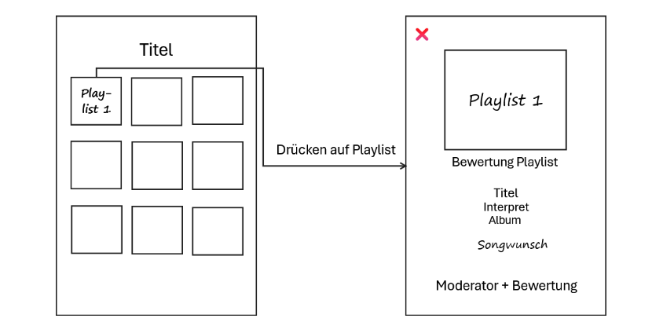
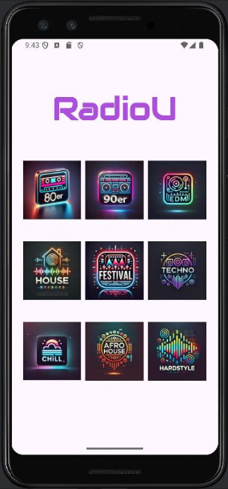
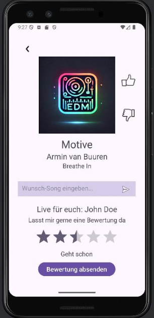

# Entwicklung einer Android-App

Dieses Projekt umfasst die Entwicklung einer App mit Android Studio und Kotlin. Ziel des Projekts war es, eine mobile Anwendung zu entwickeln, die es den Nutzern ermöglicht:
 - aktuelle Titelinformationen abzurufen
 - Songwünsche zu übermitteln
 - Radiomoderatoren und Playlists zu bewerten

Zur Planung und Visualisierung der Anwendung wurde zunächst eine entsprechende Entwurfsskizze erstellt:

## Ergebnis
Die App bietet eine übersichtliche Startseite mit neun verschiedenen Musikrichtungen wie House, Techno, 80er und EDM, die als 3x3-Icon-Raster dargestellt werden. 

Durch Antippen einer Playlist gelangt der Nutzer in die Detailansicht. Dort werden die Songinformationen wie Titel, Interpret, Album und der zugehörige Moderator angezeigt. Der Nutzer kann die Playlist 
mit einem Like oder Dislike bewerten, wobei die Buttons nach der Interaktion kurz verschwinden und so ein visuelles Feedback geben. Zudem besteht die Möglichkeit, einen Songwunsch über ein Texteingabefeld
zu übermitteln. Für die Moderatoren steht ein 5-Sterne-Rating mit halben Schritten zur Verfügung, das mit Bewertungsstufen von "Sehr schlecht" bis "Sehr gut" hinterlegt ist. 

## Technische Umsetzung
Die Entwicklung der App erfolgte mit Kotlin in Android Studio. Das UI-Layout wurde in XML erstellt und nutzt Komponenten wie TableLayout für die übersichtliche Rasterdarstellung der Playlists, ImageButton
für die interaktiven Playlist-Icons und RatingBar für die Sternebewertung der Moderatoren. 

Die Daten für die Playlists werden über einen RadioStub bereitgestellt, der als Platzhalter für eine spätere Anbindung an bestehende Systeme des Radiosenders dient. Dieser enthält für jede der neun Playlists
die relevanten Informationen wie Titel, Interpret, Album und den zugehörigen Moderator. Beim Antippen einer Playlist wird die Detailansicht geöffnet und die entsprechenden Daten über einen Intent übergeben.

## Funktionstests
Die App wurde während der gesamten Entwicklung regelmäßig getestet. Die folgenden Punkte wurden dabei überprüft:
- Begutachten, dass alle UI-Komponenten (Buttons, Textfelder, etc.) korrekt angezeigt werden
- Überprüfung der responsiven Gestaltung, also wie die App auf unterschiedlichen Bildschirmgrößen aussieht
- Testen, ob alle neun Playlists bei einer Benutzerinteraktion aufgerufen werden und ob der Inhalt der Playlists entsprechend angezeigt wird
- Schauen, ob die Navigation zurück zur Startseite funktioniert
- Probieren, ob der Like- und Dislike-Button nach dem Berühren kurz verschwindet
- Kontrollieren der Eingabe des Songwunsches und der Ausgabe von „Danke“ nach dem Abschicken
- Testen der Meldung „Bitte einen Songwunsch eingeben.“ bei fehlender Eingabe eines Songs
- Untersuchen, ob die Sternebewertung aus fünf Sternen besteht und wie gewünscht zu Beginn auf 2.5 Sterne eingestellt ist
- Vergewissern, dass auch alle Bewertungen von null bis fünf in Halbkomma-Schritten eingestellt werden können
- Ermitteln der Korrektheit der sich ändernden Beschreibungen bei einer unterschiedlichen Anzahl an Sternen
- Überprüfen der korrekten Anzeige der Sternebewertung und der Änderung des Buttons von „Bewertung absenden“ zu „Bewertung abgesendet“ nach erfolgreicher Abgabe
- Sicherstellen, dass die Eingabedaten (Songwunsch und Bewertung) ordnungsgemäß in die Datenbank übertragen werden
- Analysieren, ob die App in allen konfigurierten Sprachen richtig angezeigt wird
Zusätzlich zu den manuellen Tests wurden auch Breakpoints und Logcat genutzt, um die Logmeldungen in Echtzeit auf potenzielle Fehlerquellen zu verfolgen. Außerdem fanden Espresso-Tests statt, die bei der
Auswertung der Richtigkeit der UI-Komponenten halfen.
